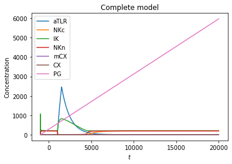

# 4) T-cell model

This project is a continuation of Professor Jihwan Myung's T-cell model in Mathematica. Its purpose is to explore which parameters have greater incidence in triggering oscillatory behaviors in this model. 

## 0.Initial model

When using the parameters and initial values:

```
#Parameters
Vtlr = 10
Ktlr = 300
Otlr = 0.001
Vnkc = 10000
Knkc = 500
Cni = 0.05
Vik = Vnkc
Kik = Knkc
Oik = 10
Inkn = 10
Onkn = 0.05
Knkn = 10
Vmcx= 1 
Kmcx =0.05
Omcx =1
Icx = 0.9
Ocx = 0.5
Vpg = 0.3
Kpg = 0.1

#Initial conditions
aTLR0 = 1
NKc0 = 6
IK0 = 10
NKn0= 1 
mCX0 = 1
CX0 = 1
PG0 = 1
```

[]()

t ∈ [-1000, 20000) (in milliseconds) 

Concentrations in nano-Mol.

The parameters for the initial values are mostly drawn from the "T-cell part 3" class.

I obtained:

%20T-cell%20model%204a959087ea1b4e44aa3dbaef18210016/Untitled.png)

Now, using logarithmic scale:



## 1.Ballpark estimates

When changing the parameter Cni from 0.1 to 0.01 it triggered an oscillational behavior in IK until it converges abruptly into a steady state.

%20T-cell%20model%204a959087ea1b4e44aa3dbaef18210016/Untitled%202.png)

Cni = 0.1.

%20T-cell%20model%204a959087ea1b4e44aa3dbaef18210016/Untitled%203.png)

Cni = 0.05 (The oscillatory behavior seems to start as one approaches 0.05 from the right side).

%20T-cell%20model%204a959087ea1b4e44aa3dbaef18210016/Untitled%204.png)

Cni = 0.01.

%20T-cell%20model%204a959087ea1b4e44aa3dbaef18210016/Untitled%205.png)

Cni = 0.001.

%20T-cell%20model%204a959087ea1b4e44aa3dbaef18210016/Untitled%206.png)

Cni = 0.0001. (Surprisingly, this took my more than a minute to compute)

%20T-cell%20model%204a959087ea1b4e44aa3dbaef18210016/Untitled%207.png)

Cni = 0.00001

When setting Inkn to 0.001 it also triggered a small oscillation in the NKc concentration across time.

%20T-cell%20model%204a959087ea1b4e44aa3dbaef18210016/Untitled%208.png)

But if I decrease Inkn to 0.0001 the NKc curve becomes nearly flat:

%20T-cell%20model%204a959087ea1b4e44aa3dbaef18210016/Untitled%209.png)

But at Inkn = 0.0004 it is possible to see an increasing curve with an oscillatory pattern of low amplitude.

%20T-cell%20model%204a959087ea1b4e44aa3dbaef18210016/Untitled%2010.png)

Using Inkn = 0.01 the curve adopts an s-shape and becomes similar to a logistic growth curve with a high r (Weisstein, n.d.). 

%20T-cell%20model%204a959087ea1b4e44aa3dbaef18210016/Untitled%2011.png)

As Inkn's value approaches 0.0015 (from the left side) the oscillatory pattern becomes indistinguishable. For comparison:

%20T-cell%20model%204a959087ea1b4e44aa3dbaef18210016/Untitled%2012.png)

Inkn = 0.0011.

%20T-cell%20model%204a959087ea1b4e44aa3dbaef18210016/Untitled%2013.png)

Inkn = 0.0015.

## 2. Range of parameters

What are the parameter sets that enable oscillations?

NKc: Inkn ∈ [0.00004, 0.0015) 

IK: Cni ∈ (0, 0.0015, 0.6) 

For NKc  and IK the amplitude of the oscillation changed according to these patterns:

%20T-cell%20model%204a959087ea1b4e44aa3dbaef18210016/Untitled%2014.png)

NKc amplitude vs time at Inkn = 0.001.

For NKc the system becomes less responsive if Oik ≤ 0.05.

%20T-cell%20model%204a959087ea1b4e44aa3dbaef18210016/Untitled%2015.png)

If Oik = 1000 and Ikn = 0.01 simultaneously, the curve shows one abrupt oscillation and then the sigmoidal curve behavior.

%20T-cell%20model%204a959087ea1b4e44aa3dbaef18210016/Untitled%2016.png)

IK amplitude vs time at Cni = 0.001.

For the IK curve to maintain its oscillatory behavior, Inkn and Onkn should be: 

Inkn ≥ 0.1 and Onkn ≥ 0.5.

## 3. Comparison with the initial values

[Initial values vs oscillation triggering values](https://www.notion.so/d6691232856341d9a4fd67fb69a40bc5)

## 4. Conclusions

I could not make the aTLR curve oscillate more than once using the binary output of Lps(t) = {0,500} just by altering the parameters in the subsequent equations.

Ideally, I would include an equation in between Lps(t) and the aTLR differential equation in the form: 

$$\dot x = \epsilon \left( x - \frac{1}{3} x^3\right) - y$$

$$\dot y = x$$

With 0 < ϵ << 1. (Kanamaru, 2007)

So that oscillation can be triggered by modifying the input the aTLR receives. 

Since this system undergoes dampening, it might approximate more the double component system behavior described in Figure 1.B in Nelson et al., 2004.

Even the system uses over 10 constants, most of the oscillation behavior could be regulated by just modifying Cni, Oik, Inkn, and Onkn. For an improved version of this model, it would be desirable to be able to try a range of parameters sequentially and update the plot in real time to see how the behavior of the curves change with minor increments/decrements to the parameters. Moreover, a function like the slider for variables like in Desmos Graphing Calculator (2021) would be highly advantageous for this task.

# References

Graphing Calculator. Desmos. (2021). [https://www.desmos.com/calculator](https://www.desmos.com/calculator).

Kanamaru, T. (2007). Van der Pol oscillator. Scholarpedia, 2(1), 2202. [https://doi.org/10.4249/scholarpedia.2202](https://doi.org/10.4249/scholarpedia.2202)

Nelson, D. E., Ihekwaba, A. E. C., Elliott, M., Johnson, J. R., Gibney, C. A., Foreman, B. E., ... & White, M. R. H. (2004). Oscillations in NF-κB signaling control the dynamics of gene expression. Science, 306(5696), 704-708.

Weisstein, E. W. (n.d.). "Logistic Equation." From MathWorld--A Wolfram Web Resource. [https://mathworld.wolfram.com/LogisticEquation.html](https://mathworld.wolfram.com/LogisticEquation.html)
